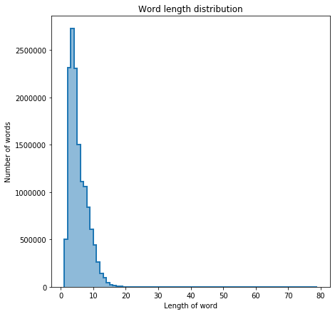
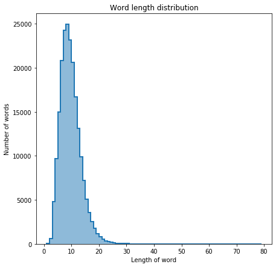
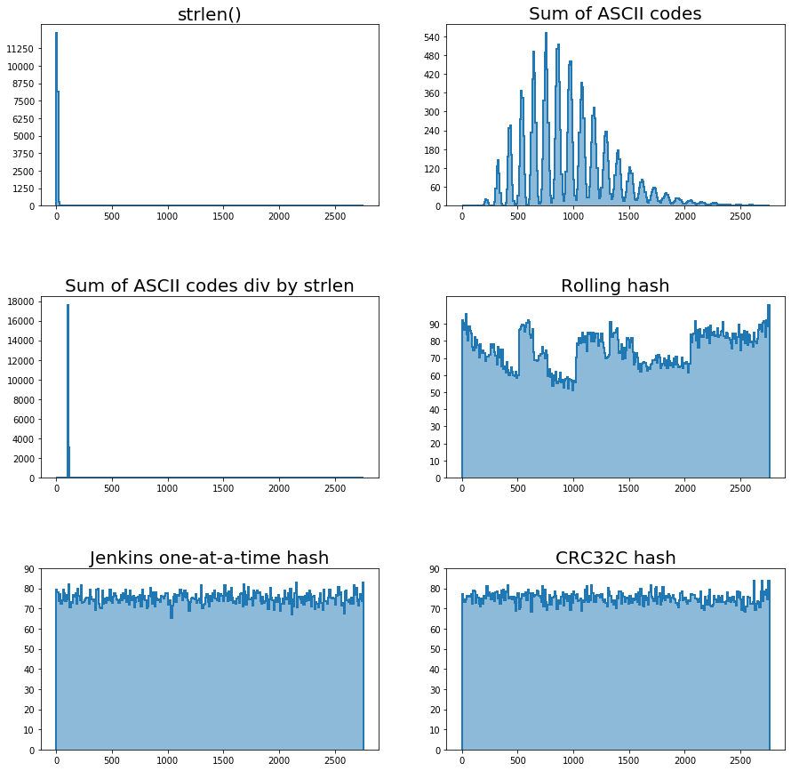
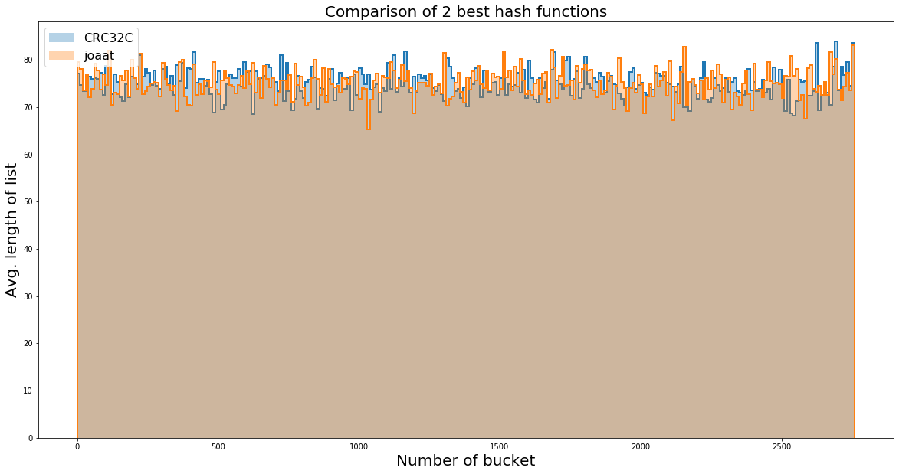
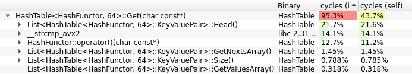
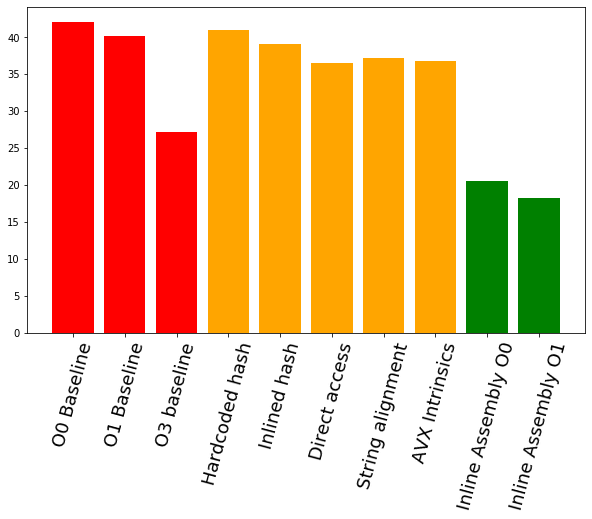

# Hash Table optimization

## Hash table 
Hash table is a data structure that implements an associative array i. e. data structure that can map keys to values. In order to do so, it computes hash value for each key and uses that hash as an array index. Since collisions between different keys are possible, this data structures utilizes the idea of buckets that store pairs of keys and values. One of the ways of implementing buckets is to use linked lists. Here is a good schematic of this datastructure [GeeksforGeeks article](https://www.geeksforgeeks.org/implementing-our-own-hash-table-with-separate-chaining-in-java/):

I have implemented this Data Structure in C++.

## Toolchain and useful links
I've used [perf](https://github.com/torvalds/linux/tree/master/tools/perf) profiler along with [Hotspot GUI](https://github.com/KDAB/hotspot). [Intel Intrinsics Guide]() would also turn out to be incredebely useful.

## Dataset
In order to test Hash Table performance, I've used MAS [Open ANC](https://www.anc.org/data/oanc/) English corpus. It contains approximately 1.5B words with average word length of 4.85 letters.

I have managed to extract 200k unique words with average length of 9.15 letters and following length distribution:

In order to choose hash function, I've loaded dataset into Hash Table of size that heavily overloads buckets. I've tested several hash functions:
1. strlen()
2. Sum of ASCII codes of symbols
3. Sum of ASCII codes of symbols divided by strlen()
4. Rolling hash
5. Jenkins one-at-a-time hash
6. CRC32C

Here is the comparison of bucket lengths with these functions:

It seems that CRC32C and joaat have best performance. If we look at close-up graph, we can see that they are almost identical

For the performance reasons I've decided to proceed with CRC32C.

## Having a look at the baseline
Baseline compiled with -O0 key takes approximately 42 seconds to run. Let's open it in profiler and see what takes so much time: 

As we can see, getters and functor calling may require quite some time to run. We can get rid of functor and hardcode hash into HashTable class, inline it int `HashTable::Get` function and provide direct access to `List` fields. Overall this will save us approximately three seconds.

## Taking advantage of processor capabilities
Modern processors have vector extensions that allow to process small vectors of data in paralell. We can utilize this in two ways:
1. Intel SSE4.2 introduced instruction for hardware-accelerated computation of CRC32C
2. Usage of vector extentions allows for parallel string comparisons by 32-symbol chunks using AVX and 16-symbol chunks using SSE.

In order to take advantage of processor capabilities, I've aligned beginning of each string on 32-byte line. I have also added trailing `\0` symbols in order for each string to fit perfectly in YMM register. After that I've implemented new version of program using compiler intrinsics. Hovewer, this did not optimized my program. Since I was compiling it with -O0 key, the program was transfering data to and from RAM after each operation, so I implemented it with inline assembly. This greately increased program speed. Here is overall time after each optimization:

And here is the speedup table. Column represents final version, row &ndash; one of the versions. Each cell is how much fater the corresponding final version compared to version in row. For instance, if -O0 baseline runs in 41.998 secons, and -O1 Final version runs in 18.155 seconds, then speedup is x2.313:

| 	                 |Final -O0 |Final -O1 |
|--------------------|----------|----------|       
|-O0 Baseline 	     |x2.048 	|x2.313    |
|-O1 Baseline 	     |x1.954 	|x2.207    |
|-O3 Baseline 	     |x1.322 	|x1.493    |
|Hardcoded Hash 	 |x1.998 	|x2.257    |
|Inlined Hash 	     |x1.905 	|x2.151    |
|Direct access 	     |x1.782 	|x2.011    |
|String alignment    |x1.809 	|x2.043    |
|AVX Intrinsics 	 |x1.792 	|x2.025    |

#### Thank you for your attention!

